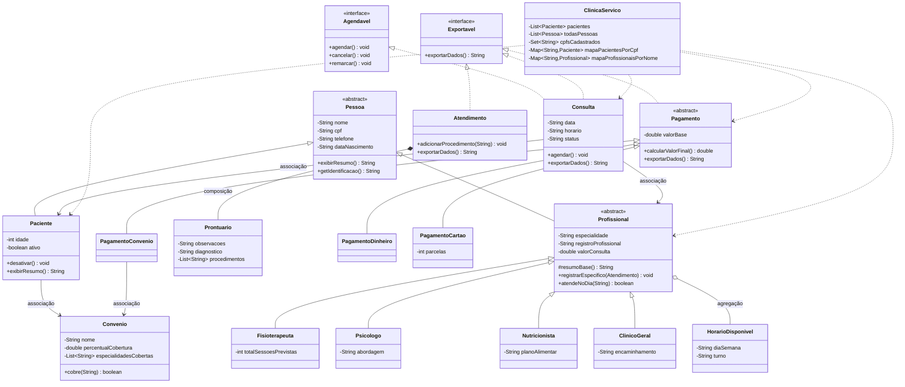

# Clínica VidaPlena — Sistema de Gestão (Evolução AV1 → AV2)

Sistema de gestão de uma clínica multidisciplinar, desenvolvido em **Java puro** (console, sem frameworks). Esta é a **etapa AV2**: uma **refatoração** do sistema procedural da AV1, reescrito aplicando os conceitos de Programação Orientada a Objetos estudados na disciplina, **preservando todas as funcionalidades** já existentes e incorporando as novas jornadas de negócio.

> A versão AV1 usava campos públicos, arrays de tamanho fixo e nenhuma herança. A AV2 reorganiza tudo em uma hierarquia de classes com encapsulamento, herança, interfaces, polimorfismo, coleções e tratamento de exceções.

---

## Índice

1. [Funcionalidades desenvolvidas](#1-funcionalidades-desenvolvidas)
2. [Estrutura de pacotes](#2-estrutura-de-pacotes)
3. [Diagrama de classes](#3-diagrama-de-classes)
4. [Mapa de aplicação dos conceitos](#4-mapa-de-aplicação-dos-conceitos)
5. [Como compilar e executar](#5-como-compilar-e-executar)
6. [Como usar o sistema](#6-como-usar-o-sistema)
7. [Tratamento de exceções](#7-tratamento-de-exceções)
8. [Jornadas de usuário atendidas](#8-jornadas-de-usuário-atendidas)

---

## 1. Funcionalidades desenvolvidas

**Pacientes**
- Cadastro em três modalidades (mínimo, com idade/telefone, completo com convênio), com validação robusta de dados.
- Complementação de cadastro posterior.
- Busca instantânea por CPF (via `HashMap`).
- Controle de unicidade de CPF (via `HashSet`).
- Desativação de paciente (bloqueia novos agendamentos).

**Profissionais** (4 especialidades)
- Cadastro especializado: **Fisioterapeuta**, **Psicólogo**, **Nutricionista** e **Clínico Geral**, cada um com dados próprios.
- Gestão de horários disponíveis (dia da semana + turno).
- Busca por nome (via `HashMap`).

**Consultas**
- Agendamento escolhendo o profissional.
- Agendamento por especialidade (sistema localiza um profissional disponível).
- Tratamento de conflito de horário com **sugestão automática** de horário livre.
- Cancelamento com regra de multa por antecedência.
- Remarcação (preserva o histórico, criando uma nova consulta).
- Bloqueio de agendamento para paciente inativo.

**Atendimentos**
- Registro clínico que cria automaticamente um **Prontuário** (composição).
- Registro de informações específicas da especialidade (sessões, abordagem, plano alimentar, encaminhamento) via polimorfismo.

**Pagamentos** (polimórficos)
- **Dinheiro/Pix**: 5% de desconto.
- **Cartão**: parcelamento em até 6x; acima de 3x, taxa de 2,5% por parcela extra.
- **Convênio**: aplica a cobertura do convênio (SaúdePlus 40%, VidaMais 30%, BemEstar 50%) e valida se a especialidade é coberta.

**Relatórios e exportação**
- Relatório unificado de cadastros (percorre `List<Pessoa>` com ligação dinâmica + `instanceof`).
- Relatório de pagamentos (percorre `List<Pagamento>` com ligação dinâmica).
- Relatório financeiro (consultas realizadas/canceladas, total recebido, multas).
- Relatórios por profissional e por período.
- Exportação uniforme de qualquer entidade que implemente `Exportavel`.

**Dados de demonstração**: a opção 8 do menu principal carrega 2 pacientes, 4 profissionais (um de cada especialidade, atendendo de segunda a sexta) e 3 convênios, para testar o sistema rapidamente.

---

## 2. Estrutura de pacotes

```
src/
└── clinica/
    ├── Main.java                       (camada de apresentação: menus e I/O)
    ├── model/                          (entidades de domínio)
    │   ├── Pessoa.java                 (abstrata)
    │   ├── Paciente.java
    │   ├── Profissional.java           (abstrata)
    │   ├── Fisioterapeuta.java
    │   ├── Psicologo.java
    │   ├── Nutricionista.java
    │   ├── ClinicoGeral.java
    │   ├── Consulta.java               (implements Agendavel, Exportavel)
    │   ├── Atendimento.java            (implements Exportavel)
    │   ├── Prontuario.java             (composição com Atendimento)
    │   ├── HorarioDisponivel.java      (agregação com Profissional)
    │   ├── Convenio.java               (associação com Paciente)
    │   ├── Pagamento.java              (abstrata, implements Exportavel)
    │   ├── PagamentoDinheiro.java
    │   ├── PagamentoCartao.java
    │   ├── PagamentoConvenio.java
    │   ├── Agendavel.java              (interface)
    │   └── Exportavel.java             (interface)
    ├── service/
    │   └── ClinicaServico.java         (regra de negócio + coleções)
    └── exception/                      (8 exceções personalizadas)
        ├── PacienteInativoException.java
        ├── PacienteNaoEncontradoException.java
        ├── ProfissionalNaoEncontradoException.java
        ├── HorarioIndisponivelException.java
        ├── ConsultaNaoEncontradaException.java
        ├── OperacaoInvalidaException.java
        ├── PagamentoInvalidoException.java
        └── ConvenioNaoCobreException.java
```

A separação em pacotes torna a **composição** genuína: o construtor de `Prontuario` é *package-private*, então apenas classes de `clinica.model` (na prática, só `Atendimento`) conseguem instanciá-lo. A `Main` e o `ClinicaServico` não conseguem criar um prontuário solto.

---

## 3. Diagrama de classes



**Legenda:** `<|--` herança (extends) · `<|..` implementação de interface (implements) · `*--` composição · `o--` agregação · `-->` associação.

---

## 4. Mapa de aplicação dos conceitos

| Conceito | Onde foi aplicado |
|---|---|
| **Encapsulamento** | Todos os atributos são `private`/`protected`, com acesso por getters/setters em todas as classes de `model`. |
| **Validação em setters** | `Pessoa.setCpf` (não vazio), `Paciente.setIdade` (não negativa), `Profissional.setValorConsulta` (não negativo), `Convenio.setPercentualCobertura` (0–100). |
| **Modificadores de acesso** | `private` (atributos e auxiliares), `protected` (`Profissional.resumoBase`, construtores de `Pessoa`/`Profissional`), `public` (API), *package-private* (construtor de `Prontuario`). Auxiliar privado: `ClinicaServico.temConflito`. |
| **Herança (3 níveis)** | `Pessoa` → `Profissional` → `Fisioterapeuta`/`Psicologo`/`Nutricionista`/`ClinicoGeral`. Cada nível adiciona atributo e método próprios; construtores chamam `super(...)`. |
| **Classes abstratas** | `Pessoa`, `Profissional`, `Pagamento` (cada uma com método abstrato + método concreto). |
| **Interfaces** | `Agendavel` e `Exportavel`. |
| **Interface + herança múltipla de tipos** | `Consulta implements Agendavel, Exportavel`. `Exportavel` é implementada por 3 classes (`Consulta`, `Atendimento`, `Pagamento`). |
| **Sobrecarga** | Construtores múltiplos em `Paciente`, `Profissional`, `Consulta`, `Pagamento`, `Convenio`; métodos `complementar(...)` e `cancelar(...)`. |
| **Sobrescrita** | `exibirResumo()` em cada subclasse de `Pessoa`; `calcularValorFinal()` em cada `Pagamento`; métodos das interfaces. Todos com `@Override`. |
| **Polimorfismo + ligação dinâmica** | `Main.relatorioUnificado` (`List<Pessoa>` → `exibirResumo()`), `Main.relatorioPagamentos` (`List<Pagamento>` → `calcularValorFinal()`), `Main.exportarDados` (`List<Exportavel>` → `exportarDados()`). |
| **Dynamic casting** | `Main.relatorioUnificado` usa `instanceof` + cast seguro para `Paciente`/`Profissional`. |
| **Associação** | `Consulta` → `Paciente`/`Profissional`; `Paciente` → `Convenio`; `PagamentoConvenio` → `Convenio`. |
| **Agregação** | `Profissional` → `List<HorarioDisponivel>` (horários sobrevivem ao profissional). |
| **Composição** | `Atendimento` → `Prontuario` (criado internamente; construtor *package-private*). |
| **Exceções personalizadas** | 8 exceções em `clinica.exception`, cada uma com 2 construtores (mensagem / mensagem + causa). |
| **try / catch / finally / throw / throws** | `ClinicaServico` declara `throws` específicos; `Main` trata em blocos `catch` separados; `finally` em `registrarPagamento` e `registrarAtendimento`; `NumberFormatException` tratada em `lerInteiro`/`lerDouble`. |
| **Coleções** | `ArrayList` (pacientes, profissionais, consultas, atendimentos, pagamentos, lista unificada); `HashSet<String>` (unicidade de CPF); `HashMap` (CPF→Paciente, nome→Profissional). |

Os comentários no código marcam explicitamente cada conceito (ex.: `// SOBRECARGA`, `// SOBRESCRITA`, `// LIGACAO DINAMICA`, `// COMPOSICAO`).

---

## 5. Como compilar e executar

**Pré-requisito:** JDK 11 ou superior (`java -version` para conferir).

### Linux / macOS

```bash
# a partir da raiz do projeto (onde fica a pasta src/)
javac -d bin -encoding UTF-8 $(find src -name "*.java")
java -cp bin clinica.Main
```

### Windows (PowerShell)

```powershell
javac -d bin -encoding UTF-8 (Get-ChildItem -Recurse -Filter *.java src | ForEach-Object { $_.FullName })
java -cp bin clinica.Main
```

### Windows (CMD)

```cmd
dir /s /b src\*.java > sources.txt
javac -d bin -encoding UTF-8 @sources.txt
java -cp bin clinica.Main
```

> Compila as 28 classes para a pasta `bin/` e executa a partir da classe `clinica.Main`.

---

## 6. Como usar o sistema

Ao iniciar, aparece o menu principal:

```
===== CLINICA VIDAPLENA =====
1 - Pacientes
2 - Profissionais
3 - Consultas
4 - Atendimentos
5 - Pagamentos
6 - Relatorios
7 - Exportar dados
8 - Carregar dados de demonstracao
0 - Sair
```

**Roteiro sugerido para testar tudo rapidamente:**

1. Digite **8** para carregar os dados de demonstração.
2. **3 → 1** (Consultas → Agendar): informe CPF `111`, profissional `Ana Fisio`, uma data de **dia útil** (ex.: a próxima segunda-feira), horário `09:00`, tipo `inicial`.
3. **4 → 1** (Atendimentos → Registrar): mesmo CPF/data/horário, preencha observações e diagnóstico.
4. **5 → 1** (Pagamentos → Registrar): mesmo CPF/data/horário, forma `dinheiro` (ou `cartao` e teste parcelas, ou `convenio`).
5. **6 → 1** (Relatório unificado): veja o polimorfismo em ação.
6. **7** (Exportar): veja todas as entidades exportadas de forma uniforme.

> **Importante sobre datas:** o agendamento verifica o dia da semana da data informada (formato `DD/MM/AAAA`) contra os horários do profissional. Os profissionais de demonstração atendem de **segunda a sexta**, então use uma data de dia útil.

Entradas inválidas (texto onde se espera número, CPF inexistente, etc.) **nunca encerram o programa** — o sistema exibe uma mensagem amigável e continua.

---

## 7. Tratamento de exceções

O sistema trata, sem travar, todos os cenários obrigatórios:

| Cenário | Exceção / tratamento |
|---|---|
| Texto onde se espera número (ex.: "abc" na idade) | `NumberFormatException` tratada com nova tentativa |
| Agendar para paciente inativo | `PacienteInativoException` |
| Agendar com CPF inexistente | `PacienteNaoEncontradoException` |
| Agendar com profissional inexistente | `ProfissionalNaoEncontradoException` |
| Agendar em horário ocupado | `HorarioIndisponivelException` (+ sugestão de horário) |
| Agendar em dia que o profissional não atende | `HorarioIndisponivelException` |
| Cancelar consulta já realizada | `OperacaoInvalidaException` |
| Cancelar consulta já cancelada | `OperacaoInvalidaException` |
| Registrar atendimento em consulta não agendada | `OperacaoInvalidaException` |
| Pagamento com tipo inválido (ex.: "cheque") | `PagamentoInvalidoException` |
| Parcelar fora do limite (1 a 6) | `PagamentoInvalidoException` |
| Pagamento por convênio sem cobertura da especialidade | `ConvenioNaoCobreException` |
| Buscar consulta inexistente (CPF + data + horário) | `ConsultaNaoEncontradaException` |

---

## 8. Jornadas de usuário atendidas

**AV1 (refeitas com os novos conceitos):** cadastro simplificado e completo de paciente, controle de duplicidade, complementação de cadastro, cadastro/atualização de profissionais, agendamento por profissional e por especialidade, tratamento de conflitos, registro de atendimento, cancelamento, remarcação, processamento de pagamentos, desativação de paciente e relatórios gerenciais (jornadas 1–13).

**AV2 (novas):** validação robusta de dados, relatório unificado de cadastros, cadastro de fisioterapeuta/psicólogo (e nutricionista/clínico geral), bloqueio de agendamento para inativo, tratamento de conflitos com exceção, verificação de cobertura de convênio, pagamentos em dinheiro/cartão/convênio, registro de atendimento com prontuário, exportação de dados, busca instantânea por CPF, controle de unicidade de CPF e tratamento completo de operações inválidas (jornadas 14–30).

---

*Disciplina de Programação Orientada a Objetos — Projeto VidaPlena, etapa AV2.*
